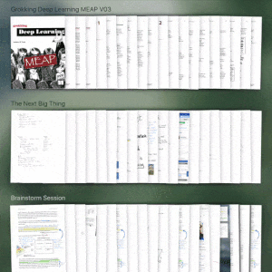
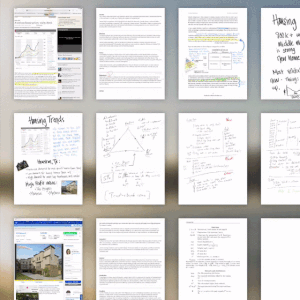
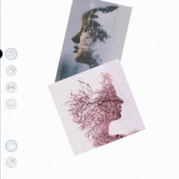
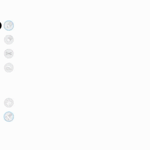
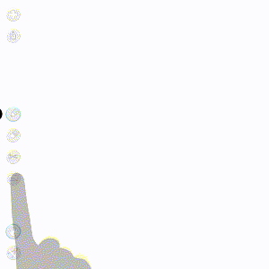

## Overview

Loose Leaf is a notes app for iPad created by [Adam Wulf](https://adamwulf.me). Learn more and see demo videos at [https://getlooseleaf.com](https://getlooseleaf.com). Support this project and [download the app on the App Store](https://itunes.apple.com/us/app/loose-leaf/id625659452?mt=8&uo=4&at=10lNUI).

Enjoy the app? Buy me a coffee ☕️ and [become a sponsor](https://github.com/sponsors/adamwulf)!

## Unique Gestures

Organize pages into documents:



Duplicate pages and scraps with gestures:




Ink sticks to imported images:



Use ruler for straight or curved lines:



Scissors can cut imported images:



More gesture videos available on the <a href='http://getlooseleaf.com'>Loose Leaf site</a>.

## Building Loose Leaf

First, clone the Loose Leaf repository and initialize all submodules:

```
git clone git@github.com:adamwulf/loose-leaf.git
cd loose-leaf
git submodule update --recursive --init
```

Next, you'll need to add your own client ids and secrets for MS App Center, Twitter, Facebook, Pinterest, Imgur, and Mixpanel. All of these are stored in a file called AppIds.plist. To get this file setup, copy from the template file:

```
cp Project/LooseLeaf/AppIds-Template.plist Project/LooseLeaf/AppIds.plist
open Project/LooseLeaf/AppIds.plist
```

If you don't have ids for some of these services, leaving them blank will still let you build and run the app, though some features may not work. 

That's it for configuration - now you can build the app and run it on your iPad!

## Get Involved

Help translate Loose Leaf into your language! Join the project and start translating here: [https://poeditor.com/join/project/UBaYwL0YTh](https://poeditor.com/join/project/UBaYwL0YTh)

Some great places to get involved and help make Loose Leaf better for everyone:

- [Feature #279](https://github.com/adamwulf/loose-leaf/issues/279), [#696](https://github.com/adamwulf/loose-leaf/issues/696), and [#697](https://github.com/adamwulf/loose-leaf/issues/697) - Add additional share options - destinations like Dropbox, Droplr, and Evernote would be nice additions
- [Feature #1576](https://github.com/adamwulf/loose-leaf/issues/1576) Update the ruler tool to act similar to Apple's Notes app and toggle to stay on the page
- [Feature #1618](https://github.com/adamwulf/loose-leaf/issues/1618) Support arbitrary page sizes instead of only screen-ratio sized pages
- [Feature #1632](https://github.com/adamwulf/loose-leaf/issues/1632) Add optional margin to imported PDFs
- [Bug #1723](https://github.com/adamwulf/loose-leaf/issues/1723) - Exporting multiple pages will often crash if the user has more than 10 documents imported. Super sneaky memory corruption bug going on here.


Loose Leaf includes a [spacecommander](https://github.com/square/spacecommander) as a submodule to help with keeping code style consistent. Please format all your code before submitting a PR by using the included format-all.sh and format-staged.sh scripts.

## More Code

Much of the Loose Leaf codebase is separated into separate submodules:

1. [PerformanceBezier](https://github.com/adamwulf/PerformanceBezier) - A small library to dramatically speed up common operations on UIBezierPath, and also bring its functionality closer to NSBezierPath
2. [ClippingBezier](https://github.com/adamwulf/ClippingBezier) - Calculates intersection points, paths, and shapes between two UIBezierPaths
3. [JotUI](https://github.com/adamwulf/JotUI) - OpenGL based drawing view that supports custom brush textures, undo/redo, and asynchronous import and export.
4. [MMStretchGestureRecognizers](https://github.com/adamwulf/MMStretchGestureRecognizers) - A collection of three gestures that can stretch an arbitrary view with four fingers, used in the clone gesture.
5. [cloudkit-manager](https://github.com/adamwulf/cloudkit-manager) - A simple wrapper to CloudKit to make passing messages with attachments easy between multiple users
6. [touch-chart](https://github.com/adamwulf/touch-chart) - Simplify and smooth UIBezierPaths by reducing the number of elements within the path

## Branches

The `master` branch contains all in-development code. The `alpha` branch contains the settings used for App Store releases. Each App Store release is tagged. The `marketing` branch shows [hand shadows](https://github.com/adamwulf/ios-hand-shadows) during gestures and is used to record demo videos.

## Icons

Many of the icons used in Loose Leaf were created in [PaintCode](https://www.paintcodeapp.com). Other icons were created with Photoshop. Both *.paintcode and *.psd files are included in the [Icons](Icons) directory. 

## Extra Applications

This repo also includes two apps used during development of Loose Leaf:

1. LittleClipper - This app was used to help test the touch-chart and ClippingBezier libraries during the development of the scissors feature.
2. ShapeShifter - This app demonstrates the use of MMStretchGestureRecognizers and helped to tune the clone scrap/page gesture.


## License
The Loose Leaf app and sample code are provided under the MIT License. Attribution is required.


## Support This Project
- Download [Loose Leaf](https://itunes.apple.com/us/app/loose-leaf/id625659452?mt=8&uo=4&at=10lNUI)
- Follow [@adamwulf](http://twitter.com/adamwulf)
- Become a [Github Sponsor](https://github.com/sponsors/adamwulf)